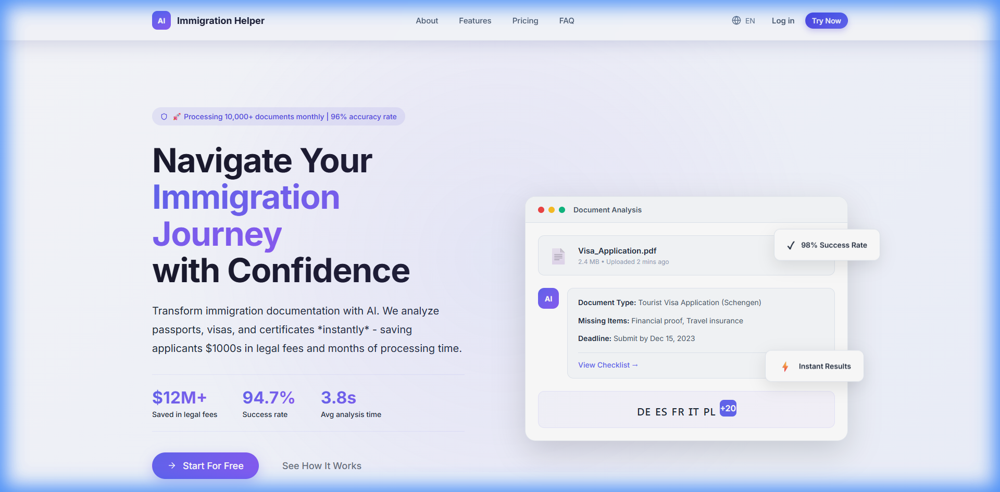

# 🌍 AI Immigration Helper

<div align="center">


**AI-powered document analysis platform for immigrants. Upload documents, get instant analysis, translations, and actionable checklists.**

[Features](#-features) · [Screenshots](#-screenshots) · [Installation](#-installation) · [Tech Stack](#️-tech-stack) · [Roadmap](#️-roadmap)

</div>

---

## ✨ Features

### 🔍 **Document Analysis**
- Upload any immigration document (PDF, JPG, PNG)
- Instant AI-powered analysis with key information extraction
- Highlight critical dates, requirements, and missing fields
- Confidence scores for accuracy assessment

### 🌐 **Multi-Language Support**
- Automatic document translation
- Support for 20+ languages
- Plain-language explanations of legal terminology

### 📋 **Smart Checklists**
- Personalized step-by-step action plans
- Deadline tracking and reminders
- Progress monitoring

### 📊 **Analytics Dashboard**
- Real-time processing statistics
- Revenue and user growth tracking
- Document type distribution charts
- KPI monitoring with trend indicators

### 🔒 **Security**
- Bank-level AES-256 encryption
- GDPR compliant data handling
- No third-party data sharing

---

## 📸 Screenshots

### Landing Page
Modern, responsive landing page with gradient hero section, feature highlights, and social proof.



### Dashboard
Full-featured dashboard with document processing, real-time statistics, and quick actions.


### Analytics
Interactive charts showing document processing trends, revenue growth, and user metrics with KPI cards.


### Document Analysis Result
AI-powered document analysis with extracted information, confidence scores, and actionable recommendations.


---

## 🛠️ Tech Stack

| Category | Technology |
|----------|------------|
| **Frontend** | React 19.1, JSX |
| **Build Tool** | Vite 7.2 (Rolldown) |
| **Styling** | CSS Modules, CSS Variables |
| **Routing** | React Router DOM 7.1 |
| **Animations** | Framer Motion |
| **Icons** | Lucide React |
| **Charts** | Custom SVG Components |

---

## 📦 Installation

### Prerequisites
- Node.js 18+ 
- npm or yarn

### Quick Start

```bash
# Clone the repository
git clone https://github.com/ViVaLaDaniel/AI-Imigration-Helper.git

# Navigate to project directory
cd AI-Imigration-Helper

# Install dependencies
npm install

# Start development server
npm run dev
```

Open [http://localhost:5173](http://localhost:5173) in your browser.

### Build for Production

```bash
npm run build
npm run preview
```

---

## 📁 Project Structure

```
src/
├── components/           # Reusable UI components
│   ├── landing/         # Hero, Features, Pricing, Footer
│   ├── dashboard/       # Sidebar, MobileTabBar
│   ├── admin/           # Admin panel components
│   └── auth/            # Authentication modals
├── pages/               # Route pages
│   ├── dashboard/       # Analytics, Documents, Settings, etc.
│   └── admin/           # Admin management pages
├── layouts/             # Layout wrappers
│   ├── DashboardLayout  # User dashboard layout
│   ├── AdminLayout      # Admin panel layout
│   └── PublicLayout     # Public pages layout
├── data/                # Mock data and constants
└── styles/              # Global styles and CSS variables
```

---

## 🗺️ Roadmap

- [ ] **Backend Integration** - Node.js/Express API with MongoDB
- [ ] **Real AI Processing** - GPT-4 / Claude integration for document analysis
- [ ] **User Authentication** - Firebase/Auth0 implementation
- [ ] **Payment Processing** - Stripe integration for subscriptions
- [ ] **Mobile App** - React Native version
- [ ] **Multi-tenant** - B2B SaaS features for law firms
- [ ] **OCR Integration** - Tesseract.js for document scanning

---

## 🤝 Contributing

Contributions are welcome! Please feel free to submit a Pull Request.

1. Fork the repository
2. Create your feature branch (`git checkout -b feature/AmazingFeature`)
3. Commit your changes (`git commit -m 'Add some AmazingFeature'`)
4. Push to the branch (`git push origin feature/AmazingFeature`)
5. Open a Pull Request

---

## 📄 License

This project is licensed under the MIT License - see the [LICENSE](LICENSE) file for details.

---

## 👤 Author

**Daniel**
- GitHub: [@ViVaLaDaniel](https://github.com/ViVaLaDaniel)

---

<div align="center">

### 💡 Made with React + Vite

⭐ **Star this repo if you find it useful!** ⭐

</div>
